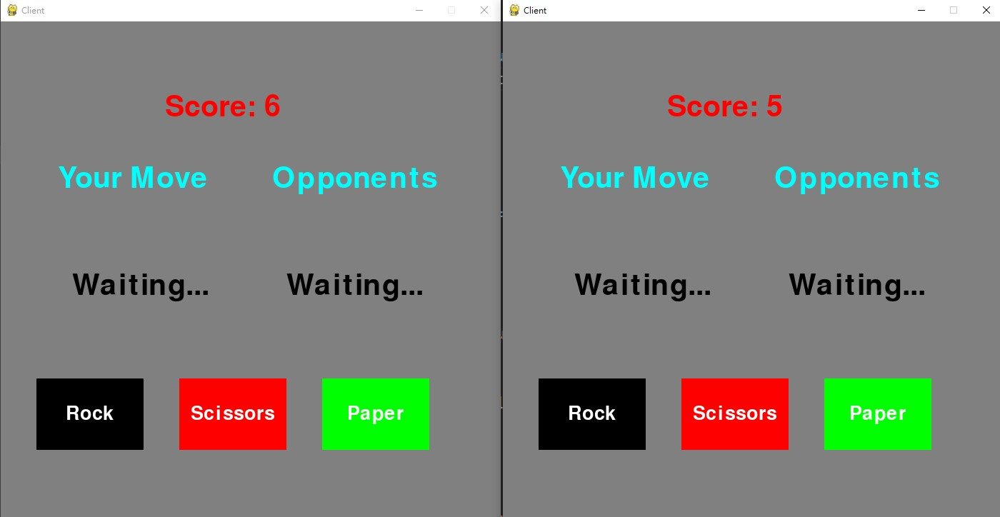

## 環境安裝
* [Anaconda](https://www.anaconda.com/products/individual)
* [XAMPP](https://www.apachefriends.org/zh_tw/index.html)(Server端)

## 執行腳本
* 執行 `!01_install_modules.bat`
* 設定 `.env`，SERVER=< SERVER 端 IP >
* (server端) XAMPP 執行 MySQL
* (server端) 執行`!02_import_sql_data.bat`，使用 pygame.sql 匯入資料庫

## 執行程式
1.	開啟三個 Anaconda Prompt 視窗

2.	一個執行 python server.py

3.	兩個執行 python client.py

4.	登入，預設帳密: `(“test”, “test”)`, `(“user01”, “user01”)`

5.	遊玩

6.	勝方分數增加(資料庫分數會更新)

## 使用到的 module
* pygame
* python-dotenv
* mysql-connector-python

## 其他
* 執行`!03_RUN_Anaconda_prompt.bat`等同執行 Anaconda Prompt
